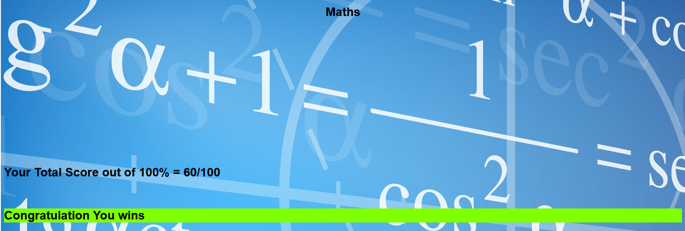

# Quiz-game

Quiz game

The game will have multiple-choice questions; the user should select the right option that answers the Question, and we have different categories of topics for questions like: History, Math, Technology, and others. The Source will be displayed at the end of the game, which will display how many times the player selects the right option. For Audio, if the user selects the right option, he will get good sound; if not, he will hear bad sound and a reaction and the Theam will be Education.

If you select the right answer it will count as 2 point and give as goode sound and green color 

If you select the wrong answer it will show 0 point and red color and bad sound

at end of game if the Score more than 60 it show wins messages

if player lose it will see lose Messages

if complated the game and want's to replay you can click reset button to reset tha game

